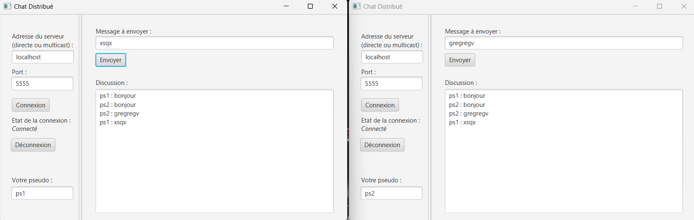

# Chat en ligne Java,JavaFx

Un systeme de chat, un serveur plusieurs clients.


### Exemple : 



###### Musique secrète quand la touche k est presser


### Acquis :

- **Multicast**

     ```java
   public void run() {
        try {
            socket = new MulticastSocket(4446);
            //socket.setOption(StandardSocketOptions.IP_MULTICAST_LOOP, false);
        } catch (IOException e) {
            throw new RuntimeException(e);
        }
        InetAddress group = null;
        try {
            group = InetAddress.getByName("224.0.0.0");
        } catch (UnknownHostException e) {
            throw new RuntimeException(e);
        }
        try {
            socket.joinGroup(group);
        } catch (IOException e) {
            throw new RuntimeException(e);
        }
        while (true) {
            DatagramPacket packet = new DatagramPacket(buf, buf.length);
            try {
                socket.receive(packet);
            } catch (IOException e) {
                throw new RuntimeException(e);
            }
            String received = new String(
                    packet.getData(), 0, packet.getLength());
            System.out.println("Message reçu : " + received);
            if ("224.0.0.0:4446".equals(received)) {
                MulticastPublisher mulP = new MulticastPublisher();
                try {
                    mulP.multicast("localhost:"+port);
                } catch (IOException e) {
                    e.printStackTrace();
                }
            }
        }
    }
     ```

- **Socket**
    ```java
    @Override
        public void run() {
            try {
                while (true) {
                    Message message = (Message) this.input.readObject();
                    if (message == null) {
                        // Client disconnected, close the connection and break the loop
                        this.clientSocket.close();
                        break;
                    }
                    System.out.println("Message received: " + message);
                    broadcastMessage(message);
                }
            } catch (IOException | ClassNotFoundException e) {
                System.err.println(e);
            } finally {
                // Remove client's output stream when client disconnects
                try {
                    clientsOutputStreams.remove(this.clientSocket.getOutputStream());
                } catch (IOException e) {
                    throw new RuntimeException(e);
                }
            }
        }

        private void broadcastMessage(Message message) {
            for (ObjectOutputStream clientOutput : clientsOutputStreams) {
                try {
                    clientOutput.writeObject(message);
                    clientOutput.flush();
                } catch (IOException e) {
                    System.err.println(e);
                }
            }
        }

    ```

- **Thread**
    ```java
    public void startsv(String port) {
        try {
            ServerSocket serverSocket = new ServerSocket(Integer.parseInt(port));
            MulticastReceiver mulR = new MulticastReceiver();
            mulR.setPort(Integer.parseInt(port));
            mulR.start();

            while (true) {
                Socket socket = serverSocket.accept();
                System.out.println("Nouveau client connecté: " + socket.getInetAddress().getHostAddress());

                ObjectOutputStream output = new ObjectOutputStream(socket.getOutputStream());
                this.clientsOutputStreams.add(output);

                Thread clientHandler = new Thread(new ClientHandler(socket));
                clientHandler.start();
            }
        } catch (IOException e) {
            System.err.println(e);
        }
    }
    ```
